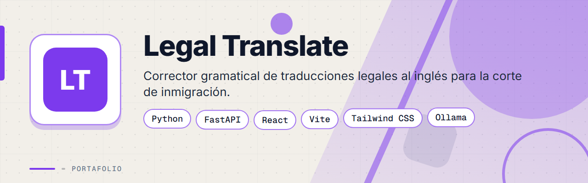
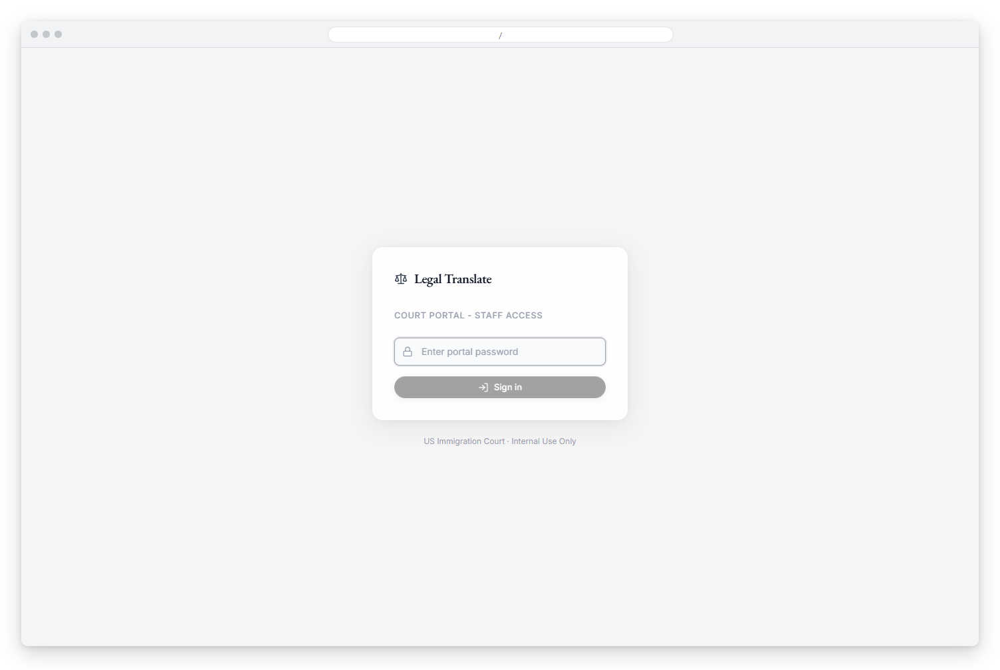
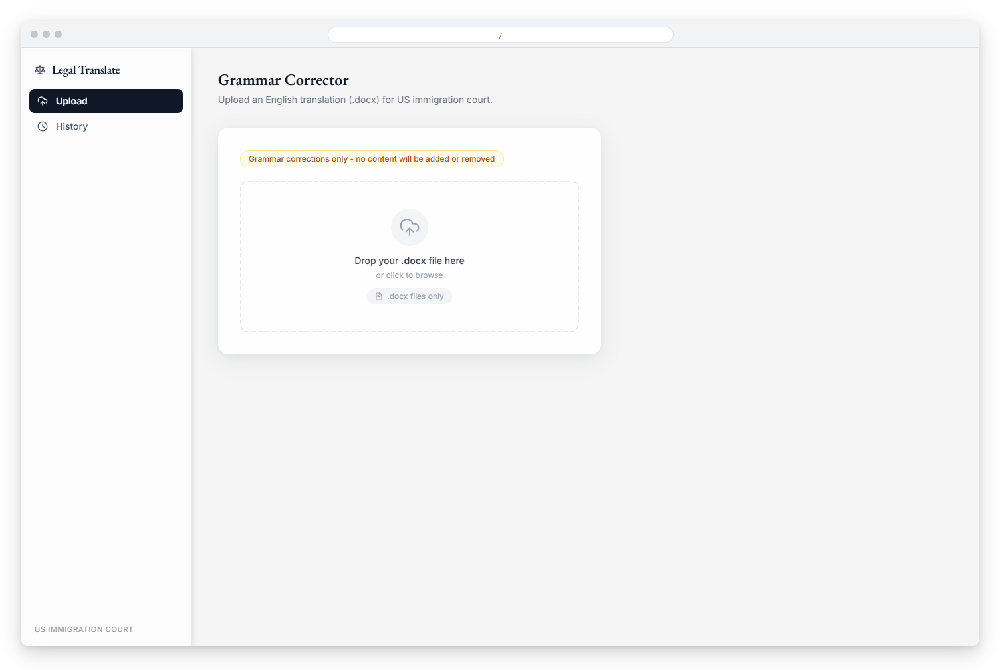
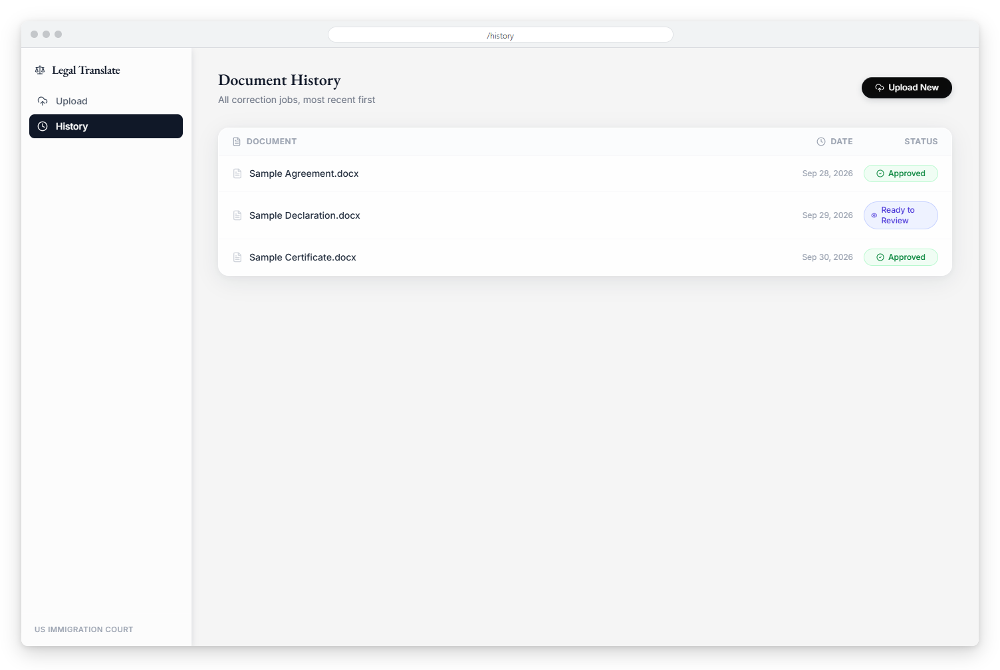
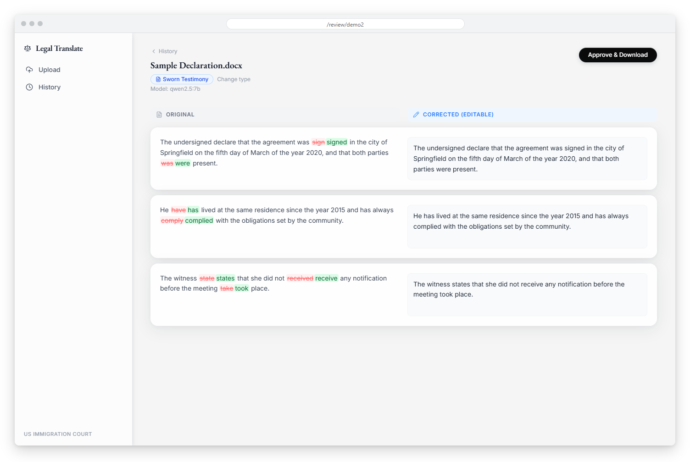
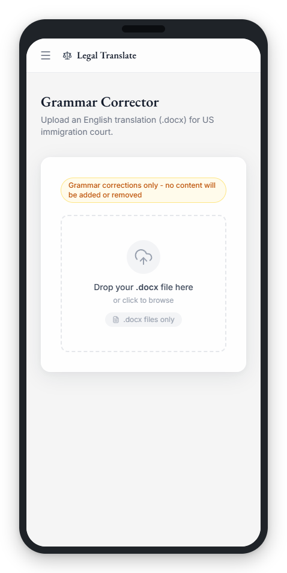
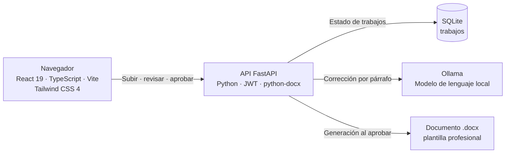

<div align="center">



# Legal Translate


**Portal web interno para que un equipo legal corrija la gramática de traducciones al inglés de cartas de asilo, revise los cambios lado a lado y descargue un documento Word con formato listo para presentar.**

</div>

> Este es un **portafolio showcase**: el código fuente es propietario y no está incluido.

---

## Contenido

- [El Problema](#el-problema)
- [La Solución](#la-solución)
- [Funcionalidades](#funcionalidades)
- [Vista Previa](#vista-previa)
- [Arquitectura](#arquitectura)
- [Stack Tecnológico](#stack-tecnológico)
- [Instalación local](#instalación-local)
- [Roadmap](#roadmap)
- [Contacto](#contacto)

---

## El Problema

Un equipo legal prepara traducciones al inglés de cartas en español para casos de asilo y refugio ante cortes de inmigración de EE. UU. Esas traducciones necesitaban:

- Corrección gramatical y de redacción sin cambiar el contenido: agregar o quitar información puede invalidar un testimonio.
- Un proceso rápido, sin copiar y pegar párrafo por párrafo en herramientas externas.
- Privacidad total: los documentos son sensibles y no deben salir hacia servicios de terceros.
- Documentos finales con un formato uniforme y profesional.

---

## La Solución

Un portal con acceso protegido donde el personal sube un archivo .docx. El backend extrae los párrafos y los corrige uno por uno con un modelo de lenguaje que corre en un servidor propio mediante Ollama, usando un prompt estricto de fidelidad: solo gramática, ortografía y redacción; nunca contenido nuevo. Después, el personal revisa el original junto al texto corregido, edita si hace falta y aprueba para descargar el documento final.

Reglas de diseño del flujo: siempre se muestra el original junto a la corrección, siempre se requiere aprobar antes de descargar, y cada trabajo registra el modelo utilizado.

---

## Funcionalidades

| Funcionalidad | Descripción |
|---------------|-------------|
| Subida de documentos | Zona de arrastrar y soltar para archivos .docx |
| Corrección con IA local | Cada párrafo se corrige con un modelo local (Ollama), con prompt de fidelidad que preserva nombres, fechas, lugares y cifras |
| Progreso en vivo | El trabajo se procesa en segundo plano y la interfaz muestra su estado |
| Revisión lado a lado | Original y corrección por párrafo, con las palabras modificadas resaltadas y edición en línea |
| Aprobación obligatoria | El documento solo se genera y descarga después de aprobar la revisión |
| Plantillas de salida | El .docx final usa un formato profesional: título centrado, cuerpo en Times New Roman y pie de certificación del traductor |
| Clasificación automática | Detecta el tipo de documento por el nombre del archivo (7 tipos, como acta de nacimiento, matrimonio, título académico o testimonio), con opción de cambiarlo antes de aprobar |
| Historial | Lista de trabajos con nombre, fecha y estado, con descarga de los documentos aprobados |
| Acceso protegido | Inicio de sesión con sesiones mediante token JWT |

---

## Vista Previa



<table>
  <tr>
    <td width="50%">
      
      <br><b>Subir documento</b>: zona de arrastrar y soltar para cargar la traducción en formato .docx.
    </td>
    <td width="50%">
      
      <br><b>Historial</b>: lista de trabajos de corrección con fecha y estado.
    </td>
  </tr>
  <tr>
    <td width="50%">
      
      <br><b>Revisión de cambios</b>: original y texto corregido lado a lado, con las palabras modificadas resaltadas y edición en línea.
    </td>
    <td width="50%"></td>
  </tr>
</table>



**Versión móvil**: la pantalla principal adaptada a pantallas pequeñas.

---

## Arquitectura



**API REST:** `POST /api/auth/login`, `POST /api/upload`, `GET /api/jobs`, `GET /api/jobs/{id}`, `POST /api/approve/{id}` y `GET /api/download/{id}`. Las rutas de documentos exigen un token JWT.

El mismo servicio FastAPI sirve la interfaz compilada, y el modelo corre en el propio servidor, por lo que el contenido de los documentos no se envía a servicios externos.

---

## Stack Tecnológico

| Capa | Tecnología |
|------|-----------|
| Frontend | React 19 · TypeScript · Vite · Tailwind CSS 4 · React Router |
| Diferencias de texto | Librería diff · iconos Lucide React |
| Backend | Python · FastAPI · Uvicorn |
| Documentos Word | python-docx |
| IA | Ollama (modelo de lenguaje local) · httpx |
| Autenticación | JWT (PyJWT) |
| Datos | SQLite (aiosqlite) |
| Despliegue | VPS Linux · Nginx · PM2 · TLS con Let's Encrypt |

---

## Instalación local

> **Aviso:** el código es privado y propietario. Estos pasos son solo para colaboradores autorizados con acceso al repositorio.

1. Instala Python 3.11 o superior, Node.js y [Ollama](https://ollama.com), y descarga el modelo configurado.
2. Backend: crea un entorno virtual, instala las dependencias y arranca la API.
   ```bash
   cd backend
   pip install -r requirements.txt
   uvicorn main:app --reload --port 8000
   ```
3. Crea un archivo `.env` en `backend` con tus propios valores (host y modelo de Ollama, contraseña del portal y secreto JWT).
4. Frontend: instala las dependencias e inicia el entorno de desarrollo.
   ```bash
   cd frontend
   npm install
   npm run dev
   ```

---

## Roadmap

- [ ] Procesar también el contenido de tablas de Word (por ejemplo, informes policiales).
- [ ] Evaluar un modelo alternativo para evitar caracteres no deseados en la salida.
- [ ] Botón para reintentar la corrección de trabajos con error.
- [ ] Extracción de campos estructurados (nombre, fecha de nacimiento, lugar) para plantillas más ricas.

---

## Contacto

El código fuente es propietario. Para consultas o propuestas, escríbeme:

[](mailto:pablozam1931@gmail.com)
[%206517--1870-25D366?style=for-the-badge&logo=whatsapp&logoColor=white)](https://wa.me/50765171870)
[](https://github.com/deadlyrat)

- Correo: [pablozam1931@gmail.com](mailto:pablozam1931@gmail.com)
- WhatsApp: [(507) 6517-1870](https://wa.me/50765171870)
- GitHub: [github.com/deadlyrat](https://github.com/deadlyrat)

---

*Parte del portafolio de [deadlyrat](https://github.com/deadlyrat)*
